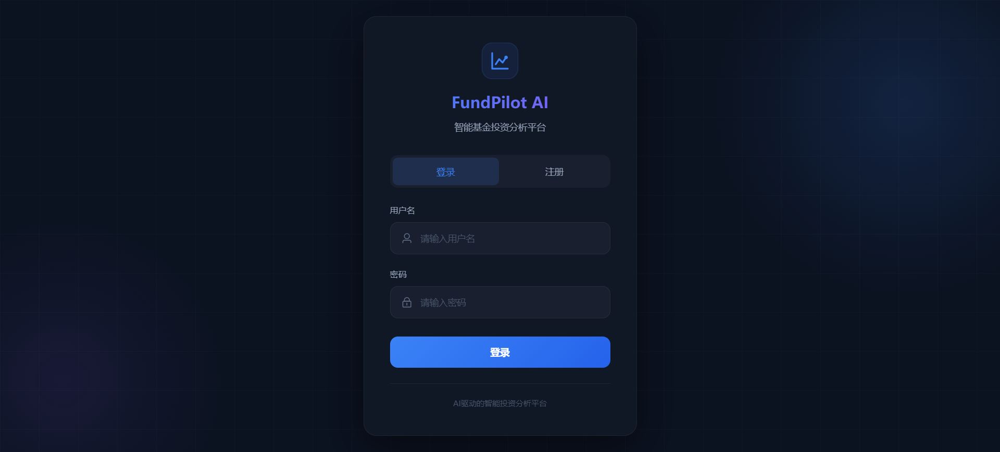
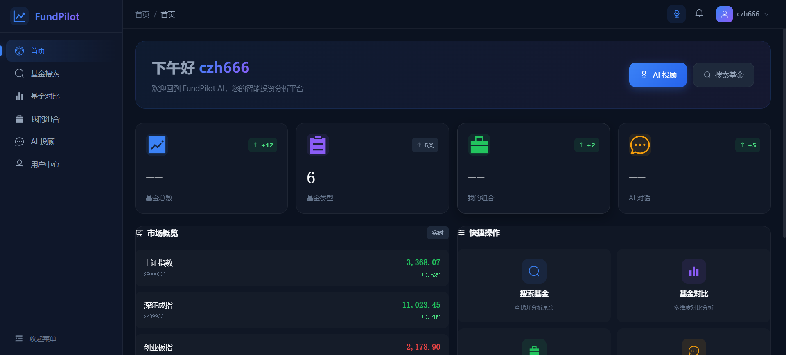
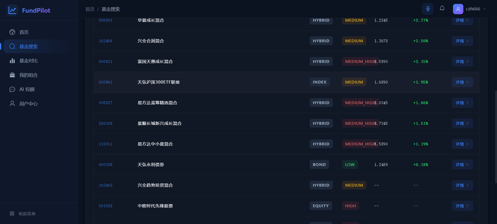
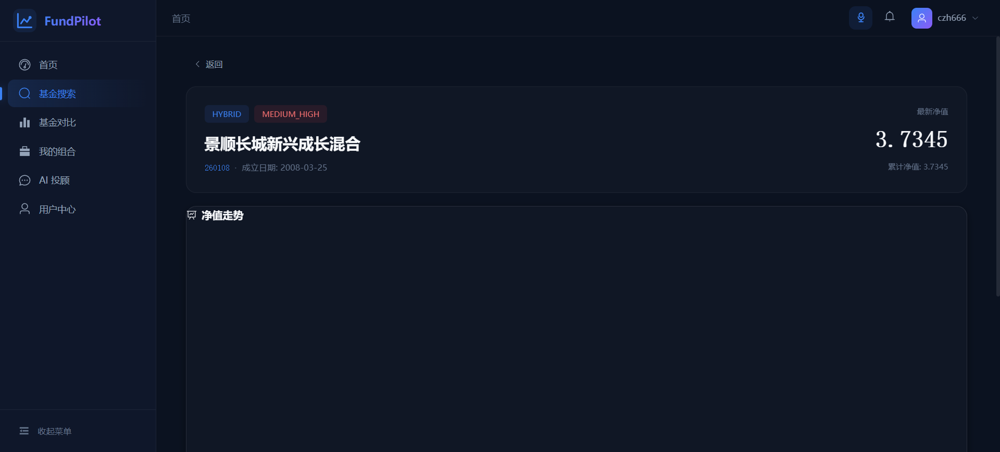
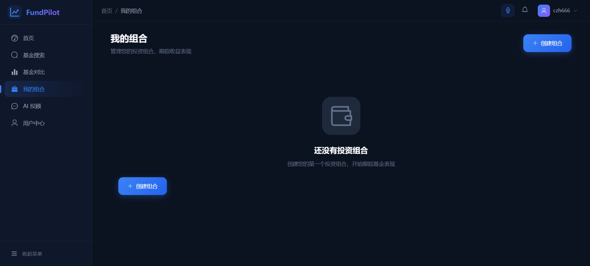
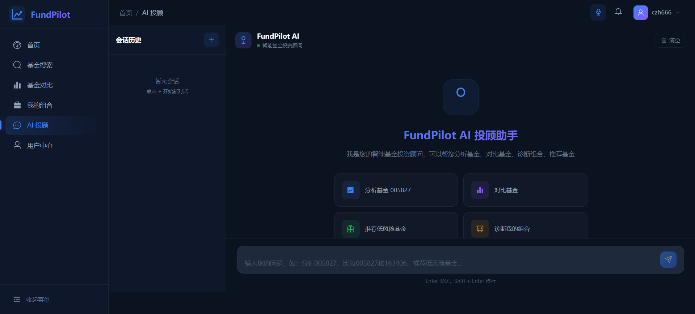
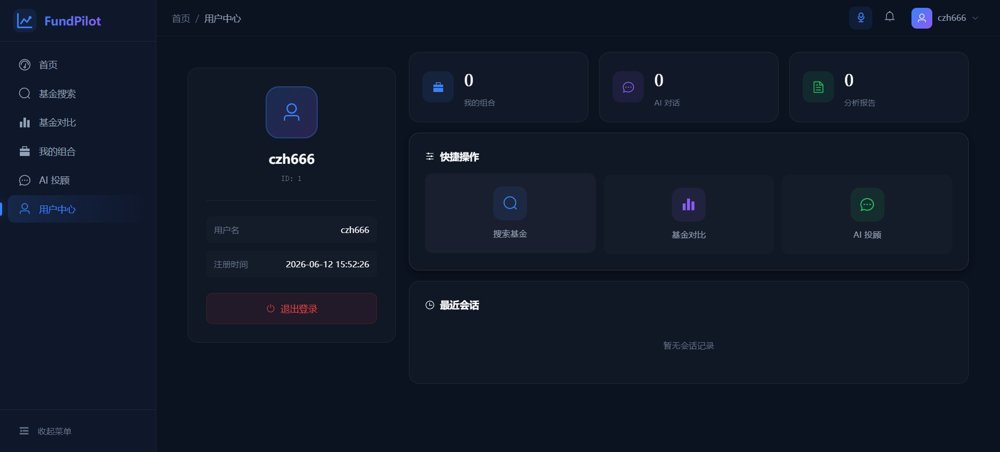

<p align="center">
  
  
  
  
  
</p>

<h1 align="center">FundPilot AI · 基金智能分析平台</h1>

<p align="center">
  基于多 Agent AI 架构的基金投资智能分析平台，支持基金搜索、组合管理、智能对比、AI 顾问对话与自动报告生成。<br />
  前后端分离 · 深色主题 · FinTech 级视觉体验
</p>

<p align="center">
  <a href="#-功能特性">功能特性</a> ·
  <a href="#-技术栈">技术栈</a> ·
  <a href="#-项目结构">项目结构</a> ·
  <a href="#-快速开始">快速开始</a> ·
  <a href="#-api-文档">API 文档</a> ·
  <a href="#-数据库设计">数据库设计</a> ·
  <a href="#-ai-多-agent-架构">AI 架构</a> ·
  <a href="#-页面预览">页面预览</a> ·
  <a href="#-开发指南">开发指南</a>
</p>

---

## ✨ 功能特性

### 📊 基金数据
- **基金搜索** — 按代码、名称、类型模糊搜索，支持分页与筛选
- **基金详情** — 净值走势、业绩指标（年化收益/最大回撤/夏普比率）、持仓分布、基金经理信息
- **基金对比** — 多基金横向对比，收益率 & 风险指标雷达图，一键生成对比报告

### 💼 组合管理
- **投资组合** — 创建/编辑/删除组合，添加/移除基金，设置持仓权重
- **组合分析** — 收益走势、资产配置饼图、行业分布、持仓重叠度分析、风险评分

### 🤖 AI 智能
- **AI 顾问** — ChatGPT 风格对话界面，支持上下文记忆，自然语言查询基金信息
- **意图路由** — 两阶段路由（关键词正则 → LLM 分类），自动分配专业 Agent 处理
- **报告生成** — 基于 AI 的基金分析报告、组合诊断报告、投资建议报告

### 🎨 设计体验
- **暗色主题** — 深色 FinTech 风格，灵感来自 Wealthfolio.ai
- **毛玻璃效果** — Glassmorphism 卡片、渐变边框、柔和阴影
- **流畅动画** — 页面过渡、数据加载骨架屏、打字指示器

---

## 🛠 技术栈

### 后端

| 技术 | 版本 | 说明 |
|------|------|------|
| **Spring Boot** | 3.3.5 | 应用框架 |
| **Spring AI** | 1.0.0-M5 | AI 集成（OpenAI 兼容模式 → 阿里云 DashScope） |
| **MyBatis-Plus** | 3.5.9 | ORM 框架，支持逻辑删除 |
| **Sa-Token** | 1.39.0 | 权限认证（Bearer Token，Redis 会话存储） |
| **Knife4j** | 4.5.0 | API 文档（Swagger UI） |
| **Hutool** | 5.8.32 | Java 工具库 |
| **MySQL** | 8.0+ | 关系数据库 |
| **Redis** | 6.0+ | 缓存 & 会话存储 |
| **DashScope** | — | LLM 服务（qwen-plus 模型） |

### 前端

| 技术 | 版本 | 说明 |
|------|------|------|
| **Vue** | 3.5+ | 渐进式框架（Composition API + `<script setup>`） |
| **Vite** | 6.0+ | 构建工具 |
| **Vue Router** | 4.4+ | 路由管理 |
| **Pinia** | 2.2+ | 状态管理 |
| **Element Plus** | 2.9+ | UI 组件库（按需自动导入） |
| **ECharts** | 5.5+ | 数据可视化 |
| **Tailwind CSS** | 4.3+ | 原子化 CSS（Vite 插件模式） |
| **Axios** | 1.7+ | HTTP 客户端 |

---

## 📁 项目结构

```
FundPilot AI/
├── fundpilot-ai-backend/                 # Spring Boot 后端
│   ├── src/main/java/com/fundpilot/
│   │   ├── controller/                   # REST 控制器（7 个）
│   │   ├── service/                      # 业务逻辑层
│   │   │   └── impl/                     # 服务实现
│   │   ├── mapper/                       # MyBatis-Plus Mapper 接口
│   │   ├── entity/                       # 数据库实体（9 张表）
│   │   ├── dto/                          # 请求 DTO
│   │   ├── vo/                           # 响应 VO
│   │   ├── config/                       # Spring 配置
│   │   ├── agent/                        # 🤖 多 Agent AI 系统
│   │   │   ├── FundAdvisorAgent          #   编排器（Orchestrator）
│   │   │   ├── AgentRouter               #   意图路由
│   │   │   ├── FundAnalysisAgent         #   基金分析 Agent
│   │   │   ├── FundComparisonAgent       #   基金对比 Agent
│   │   │   ├── FundRecommendationAgent   #   基金推荐 Agent
│   │   │   ├── PortfolioDiagnosisAgent   #   组合诊断 Agent
│   │   │   ├── tool/                     #   8 个 Tool Calling 函数
│   │   │   ├── prompt/                   #   系统提示词
│   │   │   └── report/                   #   报告生成子系统
│   │   └── common/                       # 通用工具（R.java、异常处理等）
│   └── src/main/resources/
│       ├── application.yml               # 主配置
│       ├── application-dev.yml           # 开发环境配置
│       ├── mapper/                       # XML Mapper 文件
│       └── db/
│           ├── schema.sql                # 建表语句（自动执行）
│           └── data.sql                  # 种子数据（自动执行）
│
├── fundpilot-ai-frontend/                # Vue 3 前端
│   ├── src/
│   │   ├── views/                        # 页面组件
│   │   │   ├── login/Login.vue           #   登录/注册
│   │   │   ├── layout/MainLayout.vue     #   主布局（侧边栏 + 顶栏）
│   │   │   ├── dashboard/Dashboard.vue   #   仪表盘
│   │   │   ├── fund/FundList.vue         #   基金列表
│   │   │   ├── fund/FundDetail.vue       #   基金详情
│   │   │   ├── fund/FundCompare.vue      #   基金对比
│   │   │   ├── portfolio/Portfolio.vue   #   组合管理
│   │   │   ├── portfolio/PortfolioAnalysis.vue  # 组合分析
│   │   │   ├── advisor/Advisor.vue       #   AI 顾问
│   │   │   ├── report/ReportView.vue     #   报告查看
│   │   │   └── user/UserCenter.vue       #   用户中心
│   │   ├── components/charts/            # ECharts 图表组件
│   │   ├── stores/                       # Pinia 状态管理
│   │   ├── api/                          # Axios API 模块
│   │   ├── router/                       # 路由配置
│   │   ├── utils/                        # 工具函数（chart.js）
│   │   └── assets/main.css               # 暗色主题设计系统
│   ├── vite.config.js                    # Vite 配置
│   └── package.json
│
├── CLAUDE.md                             # Claude Code 项目指引
└── README.md                             # 本文件
```

---

## 🚀 快速开始

### 环境要求

| 依赖 | 版本 | 说明 |
|------|------|------|
| **JDK** | 17+ | 推荐 Eclipse Temurin |
| **Maven** | 3.8+ | 构建后端 |
| **Node.js** | 18+ | 构建前端 |
| **MySQL** | 8.0+ | 数据库 |
| **Redis** | 6.0+ | 缓存 & 会话 |

### 1. 克隆项目

```bash
git clone https://github.com/your-username/fundpilot-ai.git
cd "FundPilot AI"
```

### 2. 初始化数据库

```sql
CREATE DATABASE fundpilot DEFAULT CHARACTER SET utf8mb4 COLLATE utf8mb4_unicode_ci;
```

> **注意：** 表结构 (`schema.sql`) 和种子数据 (`data.sql`) 会在后端首次启动时自动执行，无需手动导入。

### 3. 配置后端

编辑 `fundpilot-ai-backend/src/main/resources/application-dev.yml`：

```yaml
spring:
  ai:
    openai:
      api-key: sk-your-dashscope-api-key   # 替换为你的 DashScope API Key
      base-url: https://dashscope.aliyuncs.com/compatible-mode/v1
      chat:
        options:
          model: qwen-plus

  datasource:
    url: jdbc:mysql://localhost:3306/fundpilot?useUnicode=true&characterEncoding=utf-8&serverTimezone=Asia/Shanghai
    username: root                            # 替换为你的 MySQL 用户名
    password: your-password                   # 替换为你的 MySQL 密码

  data:
    redis:
      host: localhost
      port: 6379
      database: 0
```

### 4. 启动后端

```bash
cd fundpilot-ai-backend
mvn spring-boot:run
```

后端将在 `http://localhost:8080` 启动。首次启动时会自动建表并导入种子数据。

### 5. 启动前端

```bash
cd fundpilot-ai-frontend
npm install
npm run dev
```

前端将在 `http://localhost:5173` 启动，自动代理 `/api` 请求到后端。

### 6. 访问应用

| 地址 | 说明 |
|------|------|
| `http://localhost:5173` | 前端应用 |
| `http://localhost:8080/doc.html` | API 文档（Knife4j/Swagger） |

---

## 📡 API 文档

所有 API 端点以 `/api` 为前缀，使用统一响应格式：

```json
{
  "code": 200,
  "message": "success",
  "data": {},
  "timestamp": 1234567890
}
```

### 认证接口 (`/api/auth`)

| 方法 | 路径 | 说明 |
|------|------|------|
| `POST` | `/api/auth/register` | 用户注册 |
| `POST` | `/api/auth/login` | 用户登录（返回 Token） |
| `GET` | `/api/auth/me` | 获取当前用户信息 |

### 基金接口 (`/api/fund`)

| 方法 | 路径 | 说明 |
|------|------|------|
| `GET` | `/api/fund/search` | 搜索基金（支持分页） |
| `GET` | `/api/fund/{code}` | 获取基金详情 |
| `GET` | `/api/fund/{code}/nav` | 获取基金净值历史 |
| `GET` | `/api/fund/{code}/holding` | 获取基金持仓 |
| `GET` | `/api/fund/{code}/manager` | 获取基金经理信息 |
| `GET` | `/api/fund/{code}/performance` | 获取基金业绩指标 |

### 组合接口 (`/api/portfolio`)

| 方法 | 路径 | 说明 |
|------|------|------|
| `GET` | `/api/portfolio` | 获取组合列表 |
| `POST` | `/api/portfolio` | 创建组合 |
| `PUT` | `/api/portfolio` | 更新组合 |
| `GET` | `/api/portfolio/{id}` | 获取组合详情 |
| `DELETE` | `/api/portfolio/{id}` | 删除组合 |
| `POST` | `/api/portfolio/{id}/fund` | 添加基金到组合 |
| `PUT` | `/api/portfolio/{id}/fund` | 更新组合内基金 |
| `DELETE` | `/api/portfolio/{id}/fund/{code}` | 从组合移除基金 |
| `GET` | `/api/portfolio/{id}/analysis` | 获取组合分析 |

### 分析接口 (`/api/analytics`)

| 方法 | 路径 | 说明 |
|------|------|------|
| `POST` | `/api/analytics/compare` | 基金对比分析 |

### 报告接口 (`/api/report`)

| 方法 | 路径 | 说明 |
|------|------|------|
| `GET` | `/api/report/fund/{code}` | 生成基金分析报告 |
| `GET` | `/api/report/compare?codes=...` | 生成基金对比报告 |
| `GET` | `/api/report/portfolio/{id}` | 生成组合分析报告 |
| `GET` | `/api/report/recommend` | 生成投资建议报告 |

### AI 顾问接口 (`/api/agent`)

| 方法 | 路径 | 说明 |
|------|------|------|
| `POST` | `/api/agent/chat` | AI 对话（支持上下文） |
| `GET` | `/api/agent/sessions` | 获取对话会话列表 |
| `DELETE` | `/api/agent/sessions/{id}` | 删除对话会话 |

### 对话接口 (`/api/chat`)

| 方法 | 路径 | 说明 |
|------|------|------|
| `POST` | `/api/chat/send` | 发送消息（同步） |
| `POST` | `/api/chat/stream` | 发送消息（SSE 流式） |

---

## 🗄 数据库设计

数据库 `fundpilot`，MySQL 8.0+，utf8mb4 编码，InnoDB 引擎。所有表均使用逻辑删除（`deleted` 字段）。

```
┌──────────────┐     ┌──────────────┐     ┌──────────────┐
│     user     │     │ fund_manager │     │     fund     │
│──────────────│     │──────────────│     │──────────────│
│ id (PK)      │     │ id (PK)      │     │ id (PK)      │
│ username     │     │ name         │     │ fund_code    │
│ password     │     │ company      │     │ fund_name    │
│ nickname     │     │ bio          │     │ fund_type    │
│ avatar       │     │ experience   │     │ risk_level   │
│ email        │     │ fund_count   │     │ status       │
│ phone        │     │ ...          │     │ manager_id   │
│ status       │     └──────────────┘     │ ...          │
│ create_time  │                          └──────┬───────┘
└──────┬───────┘                                 │
       │                                    ┌────┴────┐
       │                                    │         │
       │                            ┌───────┴──┐ ┌────┴───────┐
       │                            │ fund_nav  │ │fund_holding│
       │                            │──────────│ │────────────│
       │                            │ id (PK)  │ │ id (PK)    │
       │                            │ fund_code│ │ fund_code  │
       │                            │ nav_date │ │ stock_code │
       │                            │ nav      │ │ stock_name │
       │                            │ acc_nav  │ │ ratio      │
       │                            │ ...      │ │ ...        │
       │                            └──────────┘ └────────────┘
       │
  ┌────┴───────┐     ┌──────────────┐
  │ portfolio  │────▶│portfolio_item│
  │────────────│     │──────────────│
  │ id (PK)    │     │ id (PK)      │
  │ user_id    │     │ portfolio_id │
  │ name       │     │ fund_code    │
  │ description│     │ amount       │
  │ ...        │     │ ratio        │
  └────────────┘     └──────────────┘

  ┌──────────────┐     ┌─────────────────┐
  │ chat_history │     │ analysis_report  │
  │──────────────│     │─────────────────│
  │ id (PK)      │     │ id (PK)         │
  │ user_id      │     │ user_id         │
  │ session_id   │     │ report_type     │
  │ role         │     │ target_id       │
  │ content      │     │ content (TEXT)  │
  │ ...          │     │ ...             │
  └──────────────┘     └─────────────────┘
```

| 表名 | 说明 | 关键字段 |
|------|------|---------|
| `user` | 用户表 | `username`, `password`, `nickname` |
| `fund_manager` | 基金经理表 | `name`, `company`, `experience` |
| `fund` | 基金信息表 | `fund_code`, `fund_name`, `fund_type`, `risk_level` |
| `fund_nav` | 基金净值表（日频） | `fund_code`, `nav_date`, `nav`, `acc_nav` |
| `fund_holding` | 基金持仓表（季度 Top 10） | `fund_code`, `stock_code`, `stock_name`, `ratio` |
| `portfolio` | 投资组合表 | `user_id`, `name`, `description` |
| `portfolio_item` | 组合明细表 | `portfolio_id`, `fund_code`, `amount`, `ratio` |
| `chat_history` | AI 对话历史表 | `user_id`, `session_id`, `role`, `content` |
| `analysis_report` | 分析报告表 | `user_id`, `report_type`, `target_id`, `content` |

---

## 🤖 AI 多 Agent 架构

FundPilot AI 的核心差异化特性是其**多 Agent AI 系统**，采用编排器 + 专家 Agent 的分层架构：

```
用户输入
  │
  ▼
┌─────────────────────┐
│  FundAdvisorAgent   │  ← 编排器（Orchestrator）
│  加载对话记忆 → 路由 │
└────────┬────────────┘
         │
         ▼
┌─────────────────────┐
│    AgentRouter       │  两阶段意图路由
│  ① 关键词正则匹配   │  （快速路径）
│  ② LLM 分类 fallback│  （兜底路径）
└────┬───┬───┬───┬────┘
     │   │   │   │
     ▼   ▼   ▼   ▼
  ┌───┐┌───┐┌───┐┌───┐
  │分析││对比││推荐││诊断│  4 个专家 Agent
  └─┬─┘└─┬─┘└─┬─┘└─┬─┘
    │    │    │    │
    ▼    ▼    ▼    ▼
  ┌─────────────────────┐
  │  8 个 Tool 函数      │  Spring AI Tool Calling
  │  FundInfoTool        │
  │  FundReturnTool      │
  │  FundRiskTool        │
  │  FundHoldingTool     │
  │  FundCompareTool     │
  │  PortfolioAnalyzeTool│
  │  FundRecommendTool   │
  │  ReportTool          │
  └─────────────────────┘
```

### Agent 说明

| Agent | 职责 | 触发场景 |
|-------|------|---------|
| `FundAdvisorAgent` | 编排器，加载记忆 → 路由意图 → 分发任务 | 所有用户请求入口 |
| `FundAnalysisAgent` | 单只基金深度分析 | "分析一下 110011" |
| `FundComparisonAgent` | 多基金横向对比 | "比较这几只基金" |
| `FundRecommendationAgent` | 基金推荐 | "推荐稳健型基金" |
| `PortfolioDiagnosisAgent` | 组合诊断与优化建议 | "诊断我的组合" |

### Tool Calling 函数

| Tool | 功能 |
|------|------|
| `FundInfoTool` | 查询基金基本信息 |
| `FundReturnTool` | 计算收益率指标 |
| `FundRiskTool` | 计算风险指标（波动率、最大回撤、夏普比率） |
| `FundHoldingTool` | 查询基金持仓 |
| `FundCompareTool` | 多基金对比分析 |
| `PortfolioAnalyzeTool` | 组合分析（资产配置、行业分布） |
| `FundRecommendTool` | 基金推荐 |
| `ReportTool` | 生成分析报告 |

---

## 🎨 页面预览

### 登录页
深色背景 + 渐变网格 + 毛玻璃登录卡片，支持登录/注册切换。



### 仪表盘

欢迎卡片 + 4 个统计指标（总资产/收益/夏普比率/基金数量）+ 市场行情面板 + 快捷操作 + AI 洞察。


### 基金列表

暗色搜索面板 + 现代数据表格，基金代码使用等宽字体，风险等级彩色标签。


### 基金详情

净值走势图（ECharts 渐变面积图）+ 业绩指标网格 + 基金经理信息 + 持仓分布表。


### 基金对比
多选基金输入 + 对比数据网格 + 收益率柱状图 + 一键生成对比报告。

### 组合管理

组合卡片网格，每个组合显示基金数量、创建日期、操作按钮。


### 组合分析
指标卡片 + 雷达图 + 风险评分表 + 饼图 + 行业分布表 + 持仓重叠分析。

### AI 顾问

ChatGPT 风格界面：左侧会话列表 + 右侧聊天区，支持打字指示器、建议卡片、自动滚动。


### 用户中心

双栏布局：左侧个人资料卡（头像/信息/退出）+ 右侧统计面板 + 快捷操作。


---

## 🔧 开发指南

### 后端开发

```bash
cd fundpilot-ai-backend

# 构建
mvn clean package

# 运行
mvn spring-boot:run

# 测试
mvn test

# 打包运行
java -jar target/fundpilot-ai-backend-1.0.0-SNAPSHOT.jar
```

**代码规范：**
- 使用 Lombok（`@Data`, `@Builder`, `@Slf4j`, `@RequiredArgsConstructor`），不手写 getter/setter
- 所有实体使用 `@TableLogic` 实现逻辑删除，不硬删除
- 统一使用 `R<T>` 包装响应
- 统一通过 `BizException` 抛出业务异常

### 前端开发

```bash
cd fundpilot-ai-frontend

# 安装依赖
npm install

# 开发服务器（http://localhost:5173）
npm run dev

# 生产构建
npm run build

# 预览生产构建
npm run preview
```

**代码规范：**
- 使用 `<script setup>` Composition API，不使用 Options API
- 使用 Tailwind CSS v4 工具类 + `main.css` 中的 CSS 自定义属性，避免行内样式
- ECharts 图表使用 `src/utils/chart.js` 中的暗色主题配置
- Element Plus 组件自动导入，无需手动 import

### 前端页面路由

| 路径 | 页面 | 侧边栏菜单 |
|------|------|------------|
| `/login` | 登录/注册 | ❌ |
| `/dashboard` | 仪表盘 | ✅ 仪表盘 |
| `/fund` | 基金列表 | ✅ 基金搜索 |
| `/fund/:code` | 基金详情 | ❌ |
| `/compare` | 基金对比 | ✅ 基金对比 |
| `/portfolio` | 组合管理 | ✅ 投资组合 |
| `/portfolio/:id/analysis` | 组合分析 | ❌ |
| `/advisor` | AI 顾问 | ✅ AI 顾问 |
| `/report/:type/:id` | 报告查看 | ❌ |
| `/user` | 用户中心 | ✅ 用户中心 |

### 状态管理（Pinia Stores）

| Store | 文件 | 职责 |
|-------|------|------|
| `user` | `stores/user.js` | 用户登录状态、Token、用户信息 |
| `fund` | `stores/fund.js` | 基金搜索、详情、净值数据 |
| `portfolio` | `stores/portfolio.js` | 组合 CRUD、组合分析 |
| `chat` | `stores/chat.js` | AI 对话会话管理 |
| `compare` | `stores/compare.js` | 基金对比数据 |

---

## 📄 许可证

本项目基于 [MIT License](LICENSE) 开源。

---

<p align="center">
  <sub>Built with ❤️ by FundPilot AI Team</sub>
</p>
